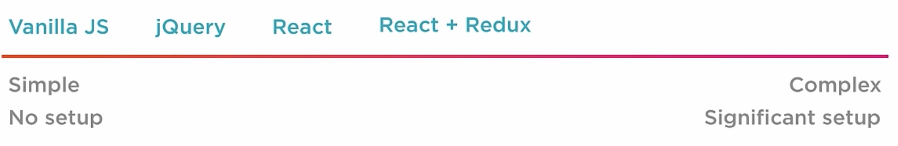
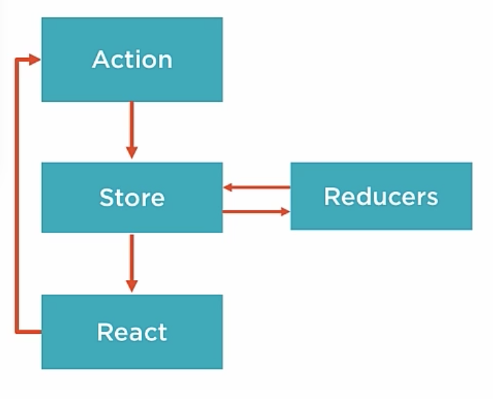
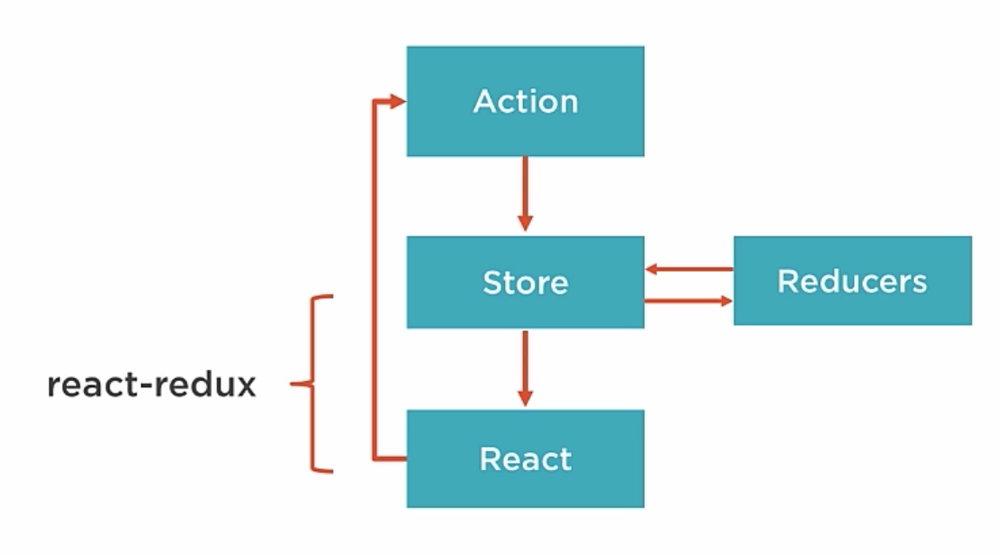
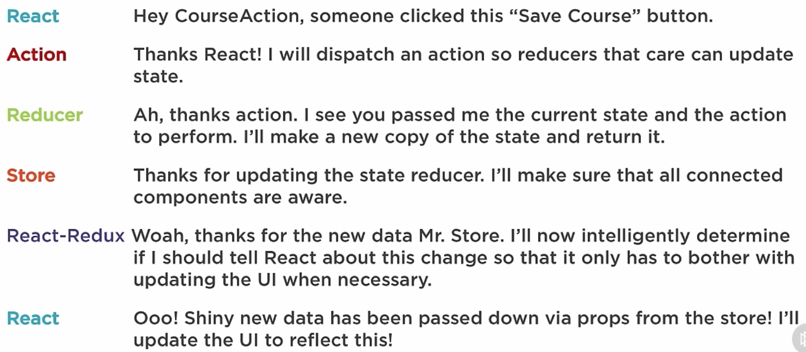

<!-- START doctoc generated TOC please keep comment here to allow auto update -->
<!-- DON'T EDIT THIS SECTION, INSTEAD RE-RUN doctoc TO UPDATE -->
**Table of Contents**  *generated with [DocToc](http://doctoc.herokuapp.com/)*

- [Building Applications with React and Redux in ES6](#building-applications-with-react-and-redux-in-es6)
  - [Environment Setup](#environment-setup)
    - [Hot Reloading](#hot-reloading)
    - [Project setup](#project-setup)
    - [ESLint](#eslint)
    - [Parallel Scripts](#parallel-scripts)
    - [Testing](#testing)
  - [React Component Approaches](#react-component-approaches)
    - [Ways to Create Components](#ways-to-create-components)
    - [ES5 createClass](#es5-createclass)
- [Hello World](#hello-world)
- [Hello World](#hello-world-1)
- [Hello World](#hello-world-2)
    - [React in ES2015](#react-in-es2015)
    - [ES5 Stateless Functional Component](#es5-stateless-functional-component)
    - [ES2015 Stateless Functional Component](#es2015-stateless-functional-component)
    - [When to use Stateless vs Class](#when-to-use-stateless-vs-class)
    - [Other Ways to Create Components](#other-ways-to-create-components)
    - [Container vs Presentation Components](#container-vs-presentation-components)
  - [Initial App Structure](#initial-app-structure)
  - [Intro to Redux](#intro-to-redux)
    - [Do I need Redux?](#do-i-need-redux)
    - [Core Redux Principles](#core-redux-principles)
    - [Redux Flow](#redux-flow)
  - [Redux Core - Deeper Dive](#redux-core---deeper-dive)
    - [Actions](#actions)
    - [Store](#store)
    - [What is Immutability](#what-is-immutability)
    - [Why Immutability?](#why-immutability)
    - [Handling Immutability](#handling-immutability)
    - [Reducers](#reducers)
  - [Connecting React to Redux](#connecting-react-to-redux)
    - [Container vs Presentational Components](#container-vs-presentational-components)
    - [React-redux Intro](#react-redux-intro)
    - [A Chat With Redux](#a-chat-with-redux)

<!-- END doctoc generated TOC please keep comment here to allow auto update -->

# Building Applications with React and Redux in ES6

> Learning React and Redux with [Pluralsight course](https://app.pluralsight.com/library/courses/react-redux-react-router-es6/exercise-files)

## Environment Setup

### Hot Reloading

Using `babel-preset-react-hmre`. Wraps components in custom proxy using Babel. Proxies are classes that behave like the classes they wrap but provide hooks for injecting new implementations. When class is saved, changes are immediately applied without requiring a reload (i.e. browser refresh).

**Warning**

* Experimental
* Doesn't reload functional components unless there's a class somewhere up hierarchy tree
* Doesn't reload container functions like `mapStateToProps`

### Project setup

[index.js](src/index.js) is app entrypoint in src dir. [index.html](src/index.html) also goes in src dir.

Webpack for app bundling with separate [dev](webpack.config.dev.js) and [prod](webpack.config.prod.js) configurations.

[npm scripts](package.json) for running tasks (instead of task runner like Grunt or Gulp).

`npm start` to kick off dev server, linting, watch, tests.

`prestart` task automatically runs before start.

Babel for transpiling ES2016 to ES5, configured with [.babelrc](.babelrc). Presets specify behaviour. `es2015` tells Babel to transpile anything that is part of the ES2015 spec. `env` section specifies to only run hot module reloading (react-hmre) in `development`.

Note `babel-preset-react-hmre` specified as devDependencies in [package.json](package.json). This preset bundles up all the hot module related code required for this feature.

`tools` folder in project root to keep all development tools organized in one place.

Express server as [development server](tools/srcServer.js) is in `tools` dir.

### ESLint

[.eslintrc](.eslintrc) extending recommneded settings, and augmented with plugins that provide enhanced linting for es2015 imports:

```json
"extends": [
  "eslint:recommended",
  "plugin:import/errors",
  "plugin:import/warnings"
]
```

Also using eslint react plugin to add react-specific rules:

```json
"plugins": [
  "react"
],
...
"react/display-name": [ 1, {"ignoreTranspilerName": false }],
"react/forbid-prop-types": [1, {"forbid": ["any"]}],
"react/jsx-boolean-value": 1,
"react/jsx-closing-bracket-location": 0,
"react/jsx-curly-spacing": 1,
"react/jsx-indent-props": 0,
...
```

0: Off

1: Warning

2: Error

`parserOptions` enable ES2015 and JSX:

```json
"parserOptions": {
  "ecmaVersion": 6,
  "sourceType": "module",
  "ecmaFeatures": {
    "jsx": true
  }
}
```

Environment section specifies which globals to allow for each environment:

```json
"env": {
  "es6": true,
  "browser": true,
  "node": true,
  "jquery": true,
  "mocha": true
}
```

Add entry to scripts section in package.json to run eslint in watch mode, using `esw` package:

```json
"lint": "node_modules/.bin/esw webpack.config.* src tools"
```

However, esw doesn't watch files by default (weird!), so call it with `--watch` flag:

```json
"lint:watch": "npm run lint -- --watch",
```

### Parallel Scripts

`npm-run-all` supports running multiple scripts and returning all their output to a single command line. Multiple scripts can be run in sequence or parallel. For example, anything specified to right of `--parallel` flag will be run at the same time:

```json
"start": "npm-run-all --parallel test:watch open:src lint:watch",
```

### Testing

Mocha is used, see [testSetup](tools/testSetup.js). Sets environment to test so dev specific features like hot module reloading are disabled:

```javascript
process.env.NODE_ENV = 'test';
```

Registers babel to transpile tests so they can also be written in ES2015:

```javascript
require('babel-register')();
```

JSDom is used to provide a virtual in-memory dom, so react components can be tested without opening a browser:

```javascript
var jsdom = require('jsdom').jsdom;
```

Note that tests are placed in the same directory as source:

```json
"test": "mocha --reporter progress tools/testSetup.js \"src/**/*.test.js\""
```

Run tests with `npm test`.

Mocha doesn't come with assertion library, will be using `expect` from npm.

## React Component Approaches

### Ways to Create Components

* ES5 createClass
* ES2015 class (used in this course)
* ES5 stateless function
* ES2015 stateless function (used in this course )
* more...

### ES5 createClass

```javascript
var HelloWorld = React.createClass({
  render: function() {
    return (
      <h1>Hello World</h1>
    );
  }
});
```

### React in ES2015

The ES5 class auto binds functions to the component's `this` context. But react components built with ES2016 classes do *not* auto bind.

```javascript
// Works fine with ES5 createClass
<div onClick={this.handleClick}></div>

// Requires explicit bind wiht ES2015 class
<div onClick={this.handleClick.bind(this)}></div>
```

For performance reasons, better to bind in constructor:

```javascript
class Contacts extends React.Component {
  constructor(props) {
    super(props);
    this.handleClick = this.handleClick.bind(this);
  }
}
```

PropTypes and default props declared separately below class definition.

Set initial state in constructor.

### ES5 Stateless Functional Component

Have no state and get their data from props. Simpler syntax, just define a function with props as argument. React assumes the return is the render function:

```javascript
var HelloWorld = function(props) {
  return (
    <h1>Hello World</h1>
  );
}
```

Good choice if component doesn't need to manage state, use lifecycle methods or do performance optimizations.

### ES2015 Stateless Functional Component

```javascript
const HelloWorld = (props) => {
  return (
    <h1>Hello World</h1>
  );
}
```

* use of `const` instead of `var`, to ensure component is never re-assigned
* use of arrow function


**Benefits**

* No class needed
* Avoid `this` keyword
* Enforced best practices, not possible to hack in state that should be in higher level container component
* High signal-to-noise ratio (less code to write therefore less noise)
* Easy to understand (its just a function that takes props and returns markup)
* Easy to test (no mocking or state manipulation required to setup tests)

### When to use Stateless vs Class

Use stateless whenever possible, unless you need:

* Local state
* Refs - reference to underlying DOM (because stateless component does not create component instance, therefore Ref will return null)
* Lifecycle methods (eg: component will mount, component did mount, etc.)
* Child functions (otherwise nesting functions in stateless component is bad for performance, because every render creates a new instance of that function)  

### Other Ways to Create Components

* Object.create
* Mixins
* Parasitic Components
* StampIt

### Container vs Presentation Components

__Container__

* Little to no markup
* Concerned with behaviour, marshalling data, passing data down to their children, and actions
* "Back end to the front end" (components don't have to emit DOM)
* Often stateful
* Created with Redux's `connect` function (if using Redux)
* Know about Redux, have Redux specific code for dispatching actions to store and connecting to store

**Presentation**

* Nearly all markup
* Dumb (no logic)
* Receive data and actions via props (from a container component), relies on these props to display UI
* Doesn't know about Redux (makes component re-usable and easier to understand), no dependencies on rest of app such as Redux or Stores.
* Don't specify how data is loaded or mutated.
* Typically stateless functional components.

Try to make most components Presentation.

**Alternative Jargon**

* Container / Presentational
* Smart / Dumb
* Stateful / Stateless
* Controller View / View

"When you notice that some components don't use props they receive but merely forward them down... it's a good time to introduce some container components." --Dan Abramov

## Initial App Structure

**Create Initial Components**

Convention to keep all components together in a `components` folder. Optionally can organize components for each page in a sub-folder under components.

Convention to name components with initial cap, eg [AboutPage.js](src/components/about/AboutPage.js), [HomePage.js](src/components/home/HomePage.js).

**Create App Layout**

Parent component for markup to be displayed on every page such as header or footer. It wraps the other components. [app.js](src/components/App.js).

**Configure Routing**

Use react router to navigate between pages. [routes.js](src/routes.js) is placed at root of `src` dir.

`IndexRoute` from `react-router` is used when there is just a root path.

**Update Entry Point**

App entry point is [index.js](src/index.js). Update it to use react router.

**Create Styles**

[styles.css](src/styles/styles.css) Note use of webpack to load styles.

**Create Header**

[Header.js](src/components/common/Header.js) - statless functional component.

To use it in [App.js](src/components/App.js), import it and use it as `<Header/>`.

**Create Course Page**

[CoursePage.js](src/components/course/CoursesPage.js) Building an app to administer courses for a training company.

## Intro to Redux

### Do I need Redux?



Depends on complexity of app. For simple, probably not. But as data flows get more complex, large number of state changes to manage. May want to manage all state changes in a single spot for maintainability and testability.

**When Do I Need Redux?**

* Complex data flows
* Inter-component communication
* Non-hierarchical data
* Many actions
* Same data used in multiple places

"...If you aren't sure if you need it, you don't need it." --Pete Hunt on Flux and Redux

For example, if have multiple components (that are not in a parent-child relationship), that need to manipulate the same data, how to ensure the data stays in sync?

Redux solution is to use a centralized `Store` (like a local client side database).

Components dispatch `Action`s that will update the single `Store`.

Once components are connected to the store, they're notified of data changes.

### Core Redux Principles

**One immutable store**

All application state is placed in a single immutable store. Supports debugging, server-side rendering, and makes undo/redo simple.

**Actions trigger changes**

The only way to mutate state is to emit an action. Action describes users intent. Eg: user clicks submit contact form button, triggers submit contact form action.

**Reducers update state**

State is changed by pure functions, called `reducer`s. Reducer is function that accepts current state in an action and returns new state.

**Containers**

Container components (regular react components but specialized use within redux) contain logic for marshalling data and actions, which are passed down to dumb components via `props`.

### Redux Flow

Actions, the Store, Reducers and container components will interact to create uni-directional data flow.



Actions describe user intent, an object with a type property and some data that can be anything. Only requirement is it must have a type, eg: `{type: RATE_COURSE, rating: 4}`.

Action will be handled by reducer, a function that receives current state and action, then returns new state.

```javascript
function appReducer(state = defaultState, action) {
  switch(action.type) {
    case RATE_COURSE:
      // return new state
    case SOME_OTHER_ACTION:
      ...
  }
}
```

After new state is returned from reducer, Store is updated. React re-renders any components that are using that data.

React components are connected to Store via `react-redux`.

## Redux Core - Deeper Dive

### Actions

Events happening in application are called Actions. Plain objects containing description of event.

Action must have `type` property, rest can be any serializable value (string, boolean, object etc). Don't put non-serializable data in action (eg: function, promise).

Actions are created by convenience functions "Action Creators",for example `rateCourse` below:

```javascript
rateCourse(rating) {
  return { type: RATE_COURSE, rating: rating } // this line is the plain object
}
```

By convention, action creator has same name as type.

### Store

Single source of truth makes app easier to manage and understand. Store created in app entry point:

```javascript
let store = createStore(reducer);
```

Store api (note no api for changing data in store). Only way to change data in store is to dispatch an action.

`store.dispatch(action)`

`store.subscribe(listener)`

`store.getState()`

`replaceReducer(nextReducer)`

Store does not handle actions that are dispatched. Actions are handled by reducers.

### What is Immutability

To change state, return a new object.

Some types in JS already immutable (every time value is changed, new copy is created):

* Number
* String
* Boolean
* Undefined
* Null

But these are mutable:

* Objects
* Arrays
* Functions

**Example**

Current state

```javascript
state = {
  name: 'Cory House',
  role: 'author'
}
```

Traditional app mutates state

```javascript
state.role = 'admin';
return state;
```

Not mutating state, returning new object

```javascript
return state = {
  name: 'Cory House',
  role: 'admin'
}
```

**Creating Copies in Javascript**

`assign` is new method on `Object` (ES2015).

`Object.assign(target, ...sources)`

Creates a new object, using existing objects as a template. First argument is target object, then pass in as many source objects as needed.

Example, start with new empty object, then "mixin" existing state, and desired state modification:

`Object.assign({}, state, {role: 'admin'})`

***Always pass empty object as first parameter to avoid mutating state!***

### Why Immutability?

**Clarity**

With mutable state, its difficult to trace through the code and figure out where/when something changed. With Redux, the answer is always "in the reducer". Makes debugging easier.

**Performance**

With a large number of properties on state object, would be expensive to have to check if each has changed. But with immutability, redux can simply do a reference comparison `if (prevStoreState !== storeState) ...`, efficient.

`react-redux` uses the comparison to determine when to notify react of state changes.

**Amazing Debugging**

Time travel debugging, via Redux DevTools.

### Handling Immutability

ES2015: `Object.assign`, Spread operator (for arrays).

ES5: Lodash merge, Lodash extend, Object-assign from npm.

Libraries: react-addons-update, Immutable.js

**Enforcing Immutability**

On a small team, educate the devs and hope everyone remembers. Otherwise...

redux-immutable-state-invariant: library displays error if attempt to mutate state. But only run in development.

Immutable.js: library to programmatically enforce immutablity.

### Reducers

To change store, dispatch an action that is ultimately handled by a reducer. Take in state and action and return new state.

```javascript
function myReducer(state, action) {
  // Return new state based on action passed
}
```

Example:

```javascript
function myReducer(state, action) {
  switch(action.type) {
    case 'INCREMENT_COUNTER':
      return Object.assign(
        {},
        state,
        {counter: state.counter + 1}
      );
  }
}
```

Reducers must be *pure functions*, no side effects. i.e. calling it with same arguments always returns same value. Return value should depend *solely* on its arguments.

**Forbidden in Reducers**

* Mutate arguments
* Perform side effects (api calls, route transitions)
* Call non-pure functions

***All*** reducers are called on each dispatch. That's why each reducer has a case/switch for action type. If no action type matches, return untouched state.

Each reducer is only passed its slice of state.

There is NOT a 1-1 mapping between reducer and action:

"Write independent small reducer functions that are each responsible for updates to a specific slice of state. This pattern is 'reducer composition'. A given action could be handled by all, some, or none of them." --Redux FAQ

## Connecting React to Redux

### Container vs Presentational Components

(or smart vs dumb)

**Container**

* Focus on how things work (data, state)
* Aware of Redux
* Subscribe to Redux State (to get their data)
* Dispatch Redux actions
* Generated by react-redux (not written by hand)

**Presentational**

* Focus on how things look
* Unaware of Redux
* Read data from props
* Fire actions by invoking callbacks on props
* Written by hand (typicall stateless functional, just need render function)

### React-redux Intro

Companion library for redux that connects react components to redux.



Note redux could be used with other libraries besides React.

react-redux consists of:

**Provider Component**

Attaches application to redux store. Used at app root. Wraps application's top level component.

```javascript
<Provider store={this.props.store}>
  <App/>
</Provider>
```

Provider makes store available to all container components in application, without having to be passed explicitly.

**Connect Function**

Creates container components. Wraps component so its connected to Redux store.

Declare what parts of store should be attached to component as props.

Declare what actions should be exposed on props.

```javascript
function mapStateToProps(state, ownProps) {
  return {appState: state.authorReducer };
}
export default connect(
  mapStateToProps,
  mapDispatchToProps
)(AuthorPage);
```

`connect` takes two functions as arguments (both optional):

1. `mapStateToProps` specify state to be exposed to component - only declare what data this component needs, performance improvement because component will only be rendered when that data changes.
1. `mapDispatchToProps` specify actions to be exposed to component.

**mapStateToProps**

What state should I expose as props? When this function is defined, component subscribes to redux store updates. Any time store updates, mapStateToProps will be called. Logical place to filter or transform state for use in component.

Trivial example:

```javascript
function mapStateToProps(state) {
  return {
    appState: state
  };
}
```

Then later in component:

```javascript
this.props.appState
```

Every time component is updated, `mapStateToProps` function is called. If doing an expensive operation, consider `Reselect`, a library that memoizes for performance. Keeps track of each function call params and result, doesn't call it again for same input, can just return the "memoized" output. i.e. caching for function calls.

**mapDispatchToProps**

What actions do I want on props?

`mapDispatchToProps` receives dispatch as argument. `bindActionCreators` function is part of redux.

```javascript
function mapDispatchToProps(dispatch) {
  return {
    actions: bindActionCreators(actions, dispatch)
  };
}
```

**Ways to Handle mapDispatchToProps**

***Option 1: Use Dispatch Directly***

Ignore it, use dispatch. When ommitted `dispatch` function will be attached to container component and can be called manually like: `this.props.dispatch(loadCourses());`

Requires more boilerplate to fire an action.

Redux concerns leak into child components.

***Option 2: Wrap Manually***

Manually wrap action creators in dispatch calls in `mapDispatchToProps` function:

```javascript
function mapDispatchToProps(dispatch) {
  return {
    loadCourses: () => {
      dispatch(loadCourses());
    },
    createCourse: (course) => {
      dispatch(createCourse(course));
    },
    updateCourse: (course) => {
      dispatch(updateCourse(course));
    }
  };
}

// In component...
this.props.loadCourses();
```

Good option for beginners to see what's going on. But manual wrapping is redundant.

***Option 3: bindActionCreators***

Use `bindActionCreators` function. Convenience function (part of redux) that wraps all actions passed to it in a dispatch call (automates option 2).

```javascript
function mapDispatchToProps(dispatch) {
  return {
    actions: bindActionCreators(actions, dispatch);
  }
}

// In component...
this.props.actions.loadCourses();
```

prop exposed to component is `actions.`

Benefit to Options 2/3 - child components don't know about redux.

### A Chat With Redux

How all the pieces interact to flow data through the app


