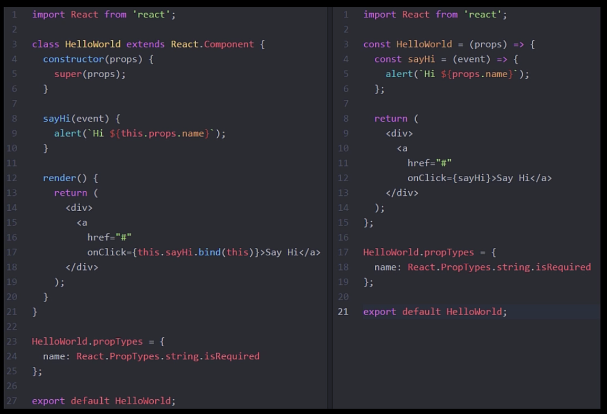

<!-- START doctoc generated TOC please keep comment here to allow auto update -->
<!-- DON'T EDIT THIS SECTION, INSTEAD RE-RUN doctoc TO UPDATE -->
**Table of Contents**  *generated with [DocToc](http://doctoc.herokuapp.com/)*

- [Building Applications with React and Redux in ES6](#building-applications-with-react-and-redux-in-es6)
  - [Environment Setup](#environment-setup)
    - [Hot Reloading](#hot-reloading)
    - [Project setup](#project-setup)
    - [ESLint](#eslint)
    - [Parallel Scripts](#parallel-scripts)
    - [Testing](#testing)
  - [React Component Approaches](#react-component-approaches)
    - [Ways to Create Components](#ways-to-create-components)
    - [ES5 createClass](#es5-createclass)
- [Hello World](#hello-world)
- [Hello World](#hello-world-1)
- [Hello World](#hello-world-2)
    - [React in ES2015](#react-in-es2015)
    - [ES5 Stateless Functional Component](#es5-stateless-functional-component)
    - [ES2015 Stateless Functional Component](#es2015-stateless-functional-component)
    - [When to use Stateless vs Class](#when-to-use-stateless-vs-class)

<!-- END doctoc generated TOC please keep comment here to allow auto update -->

# Building Applications with React and Redux in ES6

> Learning React and Redux with [Pluralsight course](https://app.pluralsight.com/library/courses/react-redux-react-router-es6/exercise-files)

## Environment Setup

### Hot Reloading

Using `babel-preset-react-hmre`. Wraps components in custom proxy using Babel. Proxies are classes that behave like the classes they wrap but provide hooks for injecting new implementations. When class is saved, changes are immediately applied without requiring a reload (i.e. browser refresh).

**Warning**

* Experimental
* Doesn't reload functional components unless there's a class somewhere up hierarchy tree
* Doesn't reload container functions like `mapStateToProps`

### Project setup

[index.js](src/index.js) is app entrypoint in src dir. [index.html](src/index.html) also goes in src dir.

Webpack for app bundling with separate [dev](webpack.config.dev.js) and [prod](webpack.config.prod.js) configurations.

[npm scripts](package.json) for running tasks (instead of task runner like Grunt or Gulp).

`npm start` to kick off dev server, linting, watch, tests.

`prestart` task automatically runs before start.

Babel for transpiling ES2016 to ES5, configured with [.babelrc](.babelrc). Presets specify behaviour. `es2015` tells Babel to transpile anything that is part of the ES2015 spec. `env` section specifies to only run hot module reloading (react-hmre) in `development`.

Note `babel-preset-react-hmre` specified as devDependencies in [package.json](package.json). This preset bundles up all the hot module related code required for this feature.

`tools` folder in project root to keep all development tools organized in one place.

Express server as [development server](tools/srcServer.js) is in `tools` dir.

### ESLint

[.eslintrc](.eslintrc) extending recommneded settings, and augmented with plugins that provide enhanced linting for es2015 imports:

```json
"extends": [
  "eslint:recommended",
  "plugin:import/errors",
  "plugin:import/warnings"
]
```

Also using eslint react plugin to add react-specific rules:

```json
"plugins": [
  "react"
],
...
"react/display-name": [ 1, {"ignoreTranspilerName": false }],
"react/forbid-prop-types": [1, {"forbid": ["any"]}],
"react/jsx-boolean-value": 1,
"react/jsx-closing-bracket-location": 0,
"react/jsx-curly-spacing": 1,
"react/jsx-indent-props": 0,
...
```

0: Off

1: Warning

2: Error

`parserOptions` enable ES2015 and JSX:

```json
"parserOptions": {
  "ecmaVersion": 6,
  "sourceType": "module",
  "ecmaFeatures": {
    "jsx": true
  }
}
```

Environment section specifies which globals to allow for each environment:

```json
"env": {
  "es6": true,
  "browser": true,
  "node": true,
  "jquery": true,
  "mocha": true
}
```

Add entry to scripts section in package.json to run eslint in watch mode, using `esw` package:

```json
"lint": "node_modules/.bin/esw webpack.config.* src tools"
```

However, esw doesn't watch files by default (weird!), so call it with `--watch` flag:

```json
"lint:watch": "npm run lint -- --watch",
```

### Parallel Scripts

`npm-run-all` supports running multiple scripts and returning all their output to a single command line. Multiple scripts can be run in sequence or parallel. For example, anything specified to right of `--parallel` flag will be run at the same time:

```json
"start": "npm-run-all --parallel test:watch open:src lint:watch",
```

### Testing

Mocha is used, see [testSetup](tools/testSetup.js). Sets environment to test so dev specific features like hot module reloading are disabled:

```javascript
process.env.NODE_ENV = 'test';
```

Registers babel to transpile tests so they can also be written in ES2015:

```javascript
require('babel-register')();
```

JSDom is used to provide a virtual in-memory dom, so react components can be tested without opening a browser:

```javascript
var jsdom = require('jsdom').jsdom;
```

Note that tests are placed in the same directory as source:

```json
"test": "mocha --reporter progress tools/testSetup.js \"src/**/*.test.js\""
```

Run tests with `npm test`.

Mocha doesn't come with assertion library, will be using `expect` from npm.

## React Component Approaches

### Ways to Create Components

* ES5 createClass
* ES2015 class (used in this course)
* ES5 stateless function
* ES2015 stateless function (used in this course )
* more...

### ES5 createClass

```javascript
var HelloWorld = React.createClass({
  render: function() {
    return (
      <h1>Hello World</h1>
    );
  }
});
```

### React in ES2015

The ES5 class auto binds functions to the component's `this` context. But react components built with ES2016 classes do *not* auto bind.

```javascript
// Works fine with ES5 createClass
<div onClick={this.handleClick}></div>

// Requires explicit bind wiht ES2015 class
<div onClick={this.handleClick.bind(this)}></div>
```

For performance reasons, better to bind in constructor:

```javascript
class Contacts extends React.Component {
  constructor(props) {
    super(props);
    this.handleClick = this.handleClick.bind(this);
  }
}
```

PropTypes and default props declared separately below class definition.

Set initial state in constructor.

### ES5 Stateless Functional Component

Have no state and get their data from props. Simpler syntax, just define a function with props as argument. React assumes the return is the render function:

```javascript
var HelloWorld = function(props) {
  return (
    <h1>Hello World</h1>
  );
}
```

Good choice if component doesn't need to manage state, use lifecycle methods or do performance optimizations.

### ES2015 Stateless Functional Component

```javascript
const HelloWorld = (props) => {
  return (
    <h1>Hello World</h1>
  );
}
```

* use of `const` instead of `var`, to ensure component is never re-assigned
* use of arrow function



**Benefits**

* No class needed
* Avoid `this` keyword
* Enforced best practices, not possible to hack in state that should be in higher level container component
* High signal-to-noise ratio (less code to write therefore less noise)
* Easy to understand (its just a function that takes props and returns markup)
* Easy to test (no mocking or state manipulation required to setup tests)

### When to use Stateless vs Class
